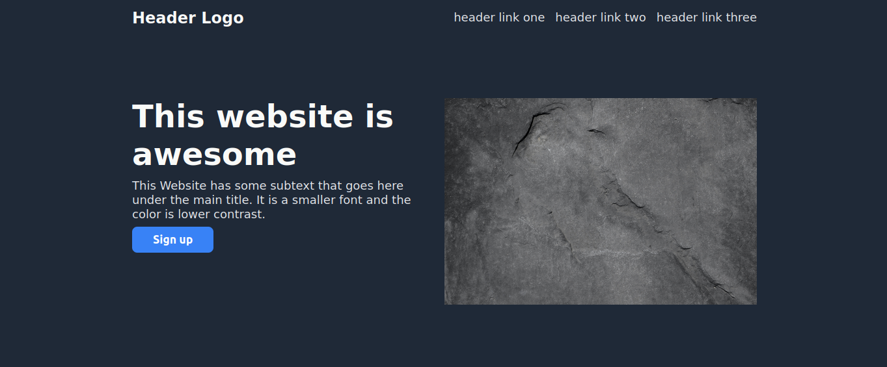
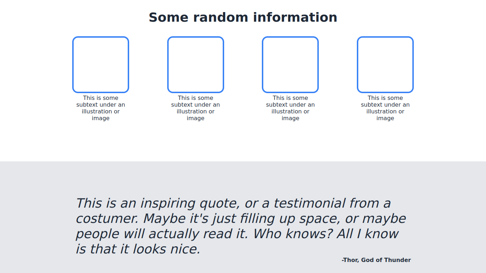
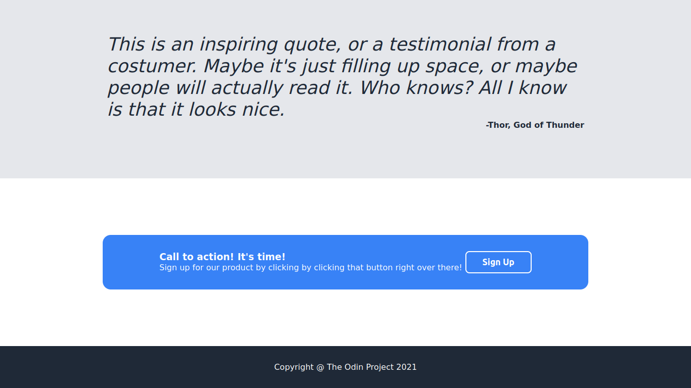

# Odin Landing Page

## 📌  Project idea

Odin Landing Page is a beautiful web page created as a solution for the chapter 5 of the section [Project: Landing Page](https://www.theodinproject.com/lessons/foundations-landing-page) of the course [Foundations](https://www.theodinproject.com/paths/foundations/courses/foundations) of [The Odin Project](theodinproject.com). This project showcases a stunning web page built using pure HTML and CSS, ensuring responsiveness on large and medium screens.

## 🔧 Technologies

## 🏗️ Development Details

Odin Landing Page was crafted using pure HTML and CSS, ensuring a clean and efficient development process.

## 📚 My learning Journey

This project allowed me to explore and learn various concepts and technologies:

📌 Embracing flexbox as a powerful pattern for building responsive layouts with well-positioned items.

📌 Deepening my knowledge of HTML and CSS, honing my front-end development skills.

# 🖼️ Screenshots

